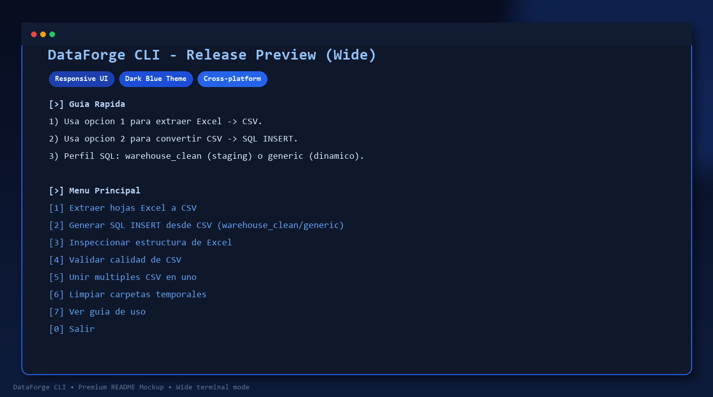
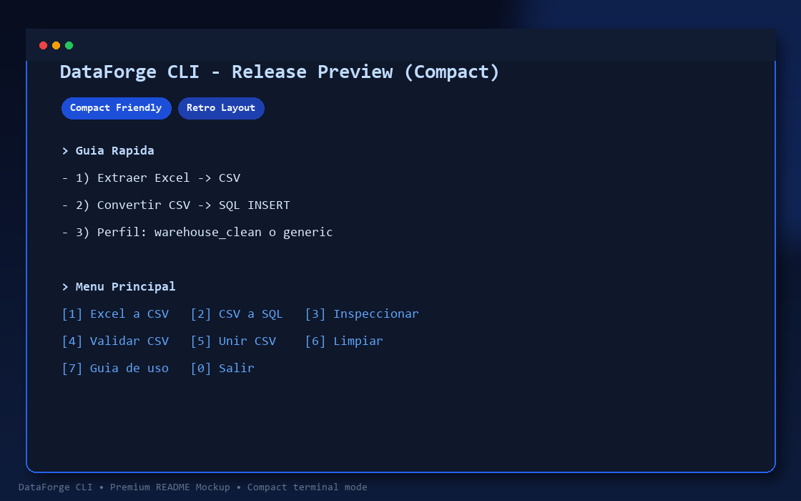
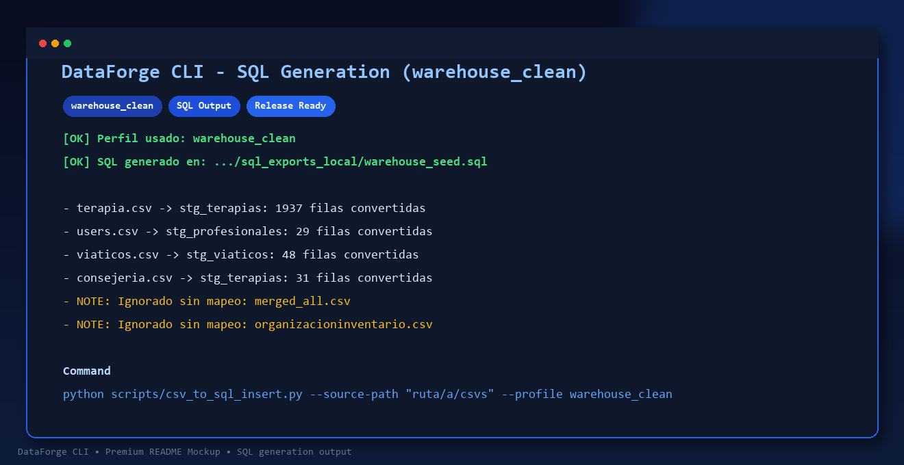

# 🚀 DataForge CLI | El Orquestador de Datos Futurista

<div align="center">


**DataForge CLI** es un toolkit de consola de alto rendimiento diseñado para la transformación fluida de datos. Convierte estructuras complejas de **Excel** a **CSV** optimizados y genera sentencias **SQL INSERT** profesionales en segundos.

*Diseñado para la eficiencia. Construido para el futuro.*

</div>

---

## 💎 Características Principales

- **📦 Extracción Inteligente**: Detecta automáticamente encabezados y limpia datos basura en hojas de Excel.
- **⚡ Perfiles Dinámicos**: Generación de SQL mediante perfiles `warehouse_clean` (para staging) o `generic`.
- **🔍 Diagnóstico Profundo**: Herramientas integradas para inspeccionar estructuras y validar calidad de datos.
- **🛠️ Versatilidad**: Soporte multiformato (`utf-8`, `latin-1`) y detección automática de delimitadores.
- **🖥️ UI Minimalista**: Menú interactivo con diseño responsive para terminales de cualquier tamaño.

---

## 🚀 Arranque Rápido

### 1. Preparar el Entorno
```bash
pip install -r requirements.txt
```

### 2. Ejecutar la Terminal
Elige tu método preferido según tu sistema:

- **Windows**: `run-tool.bat`
- **Linux/macOS**: `sh run-tool.sh`
- **Universal**: `python scripts/data_toolkit_cli.py`

### 3. Flujo Maestro
1.  **Opción `1`**: Transforma tus hojas de Excel en archivos CSV limpios.
2.  **Opción `2`**: Convierte esos CSV en potentes scripts SQL listos para producción.

---

## 📸 Capturas de Pantalla

<div align="center">

### Menú en Terminal Ancha


### Menú en Terminal Compacta


### Generación SQL en Acción


</div>

---

## 🛠️ Herramientas Disponibles

- `1` 📄 **Extraer Excel a CSV**: Desglose completo de libros de trabajo.
- `2` 🗄️ **Generar SQL INSERT**: Automatización de scripts de carga.
- `3` 🕵️ **Inspeccionar Excel**: Análisis de la estructura interna antes de procesar.
- `4` ✅ **Validar CSV**: Control de calidad y detección de anomalías.
- `5` 🔗 **Unir CSVs**: Consolidación de múltiples fuentes en un solo archivo.
- `6` 🧹 **Limpieza**: Mantenimiento de carpetas temporales de salida.

---

## 🏗️ Arquitectura del Proyecto

```text
.
|-- 📂 scripts/           # Motores de ejecución y lógica
|   |-- 📂 lib/           # Librerías de procesamiento core
|-- 📂 docs/              # Activos y documentación
|-- 📂 data/              # Depósito de entrada/salida
|-- 📄 run-tool.bat       # Lanzador Windows
|-- 📄 run-tool.sh        # Lanzador Linux/macOS
|-- 📄 requirements.txt   # Dependencias base
```

---

## 🌐 Compatibilidad y CI

El toolkit está diseñado para ser agnóstico del sistema operativo. Contamos con integración continua (**GitHub Actions**) validada en:
- ✅ **Ubuntu (Linux)**
- ✅ **Windows**
- ✅ **macOS**

---

<div align="center">

### 👨‍💻 Creado Por: Danny Maaz

[](https://github.com/dannymaaz)
[](https://www.linkedin.com/in/danny-maaz-a566251b5/)

#### ✨ ¿Te gusta el proyecto? ¡Apóyalo! ✨

[](https://paypal.me/Creativegt)

---

**© 2024 - Proyectos con Pasión**

</div>
